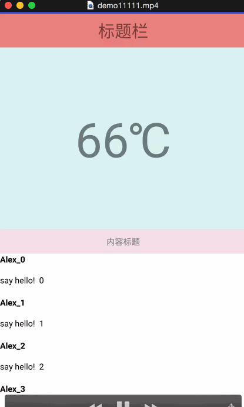

# CollapseableLayout

很常见的一个可折叠的根布局，一般都是上下两块，如图所示交互效果：


## How to use!
具体参见Moudule app。

### 布局介绍：
```
    <com.demon.library.CollapseableLayout
        android:id="@+id/collapseablelayout"
        android:layout_width="match_parent"
        android:layout_height="match_parent"
        app:collapse_content="@+id/content"
        app:collapse_header="@+id/header"
        app:collapse_scroll="@+id/recyclerview"
        app:collapse_shrink_height="@dimen/title_bar_height">
```
 - **app:collapse_header:** 指向Header布局ID
 - **app:collapse_content:** 指向Content布局ID
 - **app:collapse_scroll:** 指向真正可以滑动的控件的ID
 - **app:collapse_shrink_height:** 最小折叠距离
 - **CollapseableLayout 只允许拥有2个直接子孩子！**

### 接口监听：
```
// 折叠偏移量监听
public interface IOnOffsetChangedListener {
        void onOffsetChanged(int verticalOffset, int maxOffset);
    }
```

```
// 离手Fling监听
public interface IOnFlingListener {
        /**
         * @param velocityY velocityY < 0 : 上滑 , 反之下滑
         */
        void onFling(float velocityY);
    }
```

### 视差效果实现：
默认情况下，header的滑动速度和上推折叠速度是一样的，如果想实现上推滑动有视差效果，可以通过**IOnOffsetChangedListener**来实现，以下是简单实现，视差因子可以自行调节！

**实现原理：视差效果的控件和父元素往反方向移动**
```
@Override
    public void onOffsetChanged(int verticalOffset, int maxOffset) {
        float alpha = ((float) maxOffset / 3 - verticalOffset) * 3 / maxOffset;
        if (alpha < 0) {
            alpha = 0;
        } else if (alpha > 1) {
            alpha = 1;
        }
        headerContent.setAlpha(alpha);
        ViewCompat.setTranslationY(headerContent, verticalOffset * 0.5f);
    }
```

## 结语：
**CollapseableLayout**的实现，参考了Android Design库中很多源码的实现，同时为了遵循MD设计原则，建议大家使用Design库来实现。会更加方便，这里只是抛砖引玉，顺便更好理解滑动监听的实现。

**onInterceptTouchEvent** 接口，一旦父元素决定拦截，那么在本次触摸过程中，触摸事件永远无法在传递给子孩子，这也是为什么该类实现上推动作要松手，在此推的原因！！Design库解决了该问题，但是CollapseableLayout这种交互也有存在的意义！如何抉择与选取，关键还是看交互需求！
